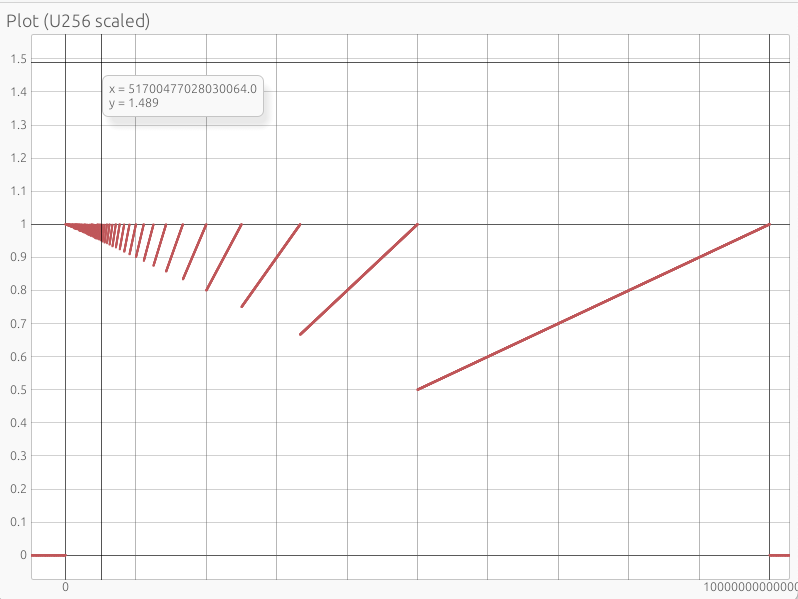

# Fixed point plotter


## Installation

Install Rust using [rustup](https://rustup.rs/).

Then

```
cargo run
```

## Interaction

(I don't know hotkeys for Windows)

You should see something like this



- to **pan**, click and drag
- to **zoom** place the mouse pointer where you want to zoom and then hold down CMD and use scroll wheel.

